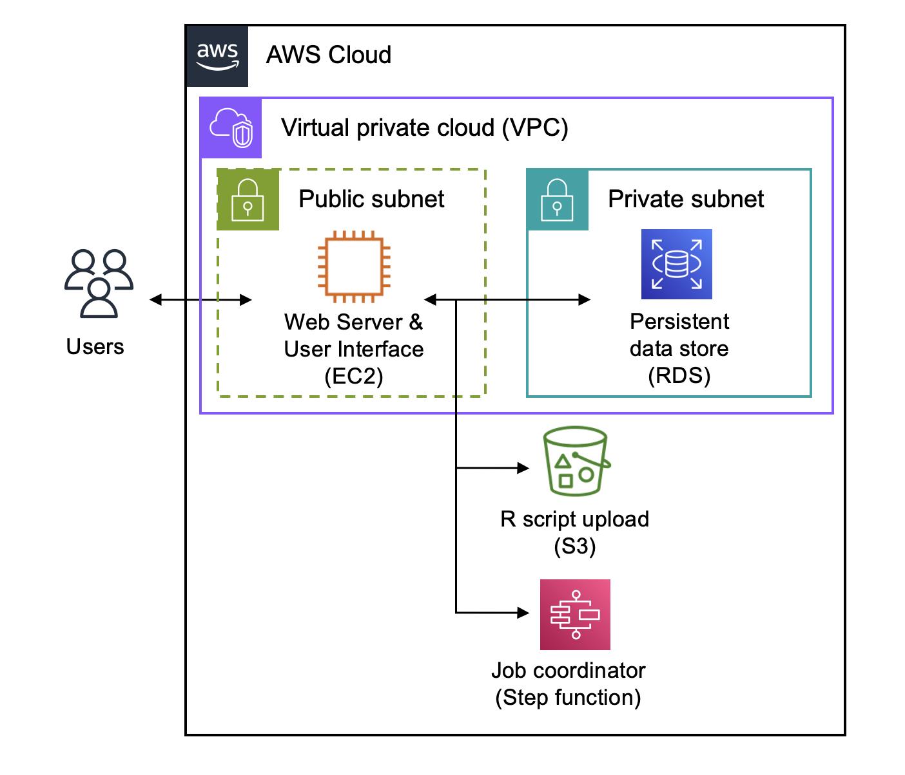

# Validation Server (Version 2.0) - Infrastructure

This repository contains the CloudFormation stack for the API and frontend infrastructure of the Urban Institute's [Safe Data Technologies](https://www.urban.org/projects/safe-data-technologies) Validation Server Version 2.0 prototype (i.e. KMS key, RDS, web server, etc.). 

## Quick Links
- [Technical White Paper](https://www.urban.org/research/publication/privacy-preserving-validation-server-version-2) 
- [Staging URL](https://sdt-validation-server.urban.org) 

## Related Repositories
- [validation-server-v2-api](https://github.com/UrbanInstitute/validation-server-v2-api): Django REST API for the validation server version 2.0 prototype
- [validation-server-v2-backend](https://github.com/UrbanInstitute/validation-server-v2-backend): Backend for the validation server version 2.0 prototype
- [validation-server-v2-frontend](https://github.com/UrbanInstitute/validation-server-v2-frontend): Frontend for the validation server version 2.0 prototype

## Deployment 

To deploy (requires [AWS CLI](https://aws.amazon.com/cli/) to be installed and configured):

```bash
./deploy.sh
```

This requires an `.env` file with the following variables set:

```
BACKEND_MASTER_USER_PASSWORD
DBPrivateSubnet
DBSecurityGroup
S3BucketName
VpcId
Region
EC2PublicSubnet
EC2SecurityGroup
Tag-Name
Tag-Project-Name
Tag-Project-Code
Tag-Tech-Team
Tag-Center
Tag-Requested-By
Tag-Created-By
Tag-Platform
```

## Architecture for API and Frontend 



## Contact
This work is developed by the Urban Institute. For questions, reach out to: validationserver@urban.org. 